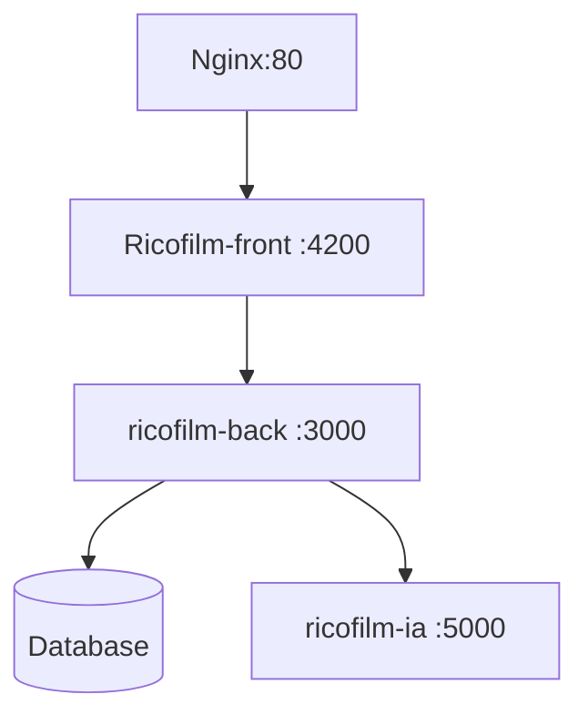

# Service permettant d'exploiter le LLM Mistral pour RicoFilm !

# Ricofilm - Architecture


# Environnement Python

## Environnement préparation
Créer d'un environnement virtuel
```
python3 -m venv myenv
```
Activer l'environnement virtuel
```
source myenv/bin/activate  # Sur macOS/Linux
```
Installer le module dans l'environnement virtuel
``` bash
pip install mistralai
pip install flask
```
## Execution
```
export MISTRAL_API_KEY="xxxxxxxxxx"
(myenv)myenv/bin/python3 test1/mistra
```
# Environement docker
1. Créer un fichier requirements.txt
Listez toutes les dépendances de votre projet dans un fichier requirements.txt. Par exemple :
```
Flask==3.1.0
mistralai==1.5.0  # Remplacez par la version appropriée
```
pour avoir les versions utilisez la commande 
```
>pip show Flask
```
3. Créer un Dockerfile
Créez un fichier nommé Dockerfile dans le répertoire racine de votre projet. Ce fichier contiendra les instructions pour construire l'image Docker. Voici un exemple de Dockerfile pour une application Flask :
``` dockerfile
# Utiliser une image de base officielle Python
FROM python:3.9-slim


# Définir le répertoire de travail dans le conteneur
WORKDIR /app


# Copier les fichiers de l'application dans le conteneur
COPY . /app


# Installer les dépendances
RUN pip install --no-cache-dir -r requirements.txt


# Exposer le port sur lequel l'application va tourner
EXPOSE 5000


# Définir la commande pour démarrer l'application
CMD ["python", "RicoSrviceIA.py"]
```

2. Utiliser un fichier .env
Vous pouvez créer un fichier .env dans le répertoire de votre projet et y définir vos variables d'environnement. Ensuite, utilisez l'option --env-file avec docker run.
Contenu du fichier .env :
```
MISTRAL_API_KEY=xxxxx
```

4. Construire l'image Docker
Ouvrez un terminal dans le répertoire de votre projet et exécutez la commande suivante pour construire l'image Docker :
```
  docker build -t ricofilm-ia .
```
6. Exécuter le conteneur Docker
Une fois l'image construite, vous pouvez exécuter un conteneur à partir de cette image :
```
docker run -d --name ricofilm-iac -p 5000:5000 --env-file .env ricofilm-ia
```

## Endpoint: `/search_movies_web`

-   **Method:** `POST`
-   **Description:** Searches for movies based on a natural language query by leveraging the Mistral AI.
-   **Request Body (JSON):**
    ```json
    {
        "requete": "your natural language movie query here"
    }
    ```
-   **Success Response (JSON):**
    Returns a list of movies, with each movie object containing `title` and `id_imdb`.
    ```json
    [
        {
            "title": "Movie Title 1",
            "id_imdb": "tt1234567"
        },
        {
            "title": "Movie Title 2",
            "id_imdb": "tt9876543"
        }
    ]
    ```
-   **Error Response (JSON):**
    In case of an error (e.g., AI response parsing issue), returns an error object.
    ```json
    {
        "error": "Error message",
        "details": "Detailed error information"
    }
    ```
